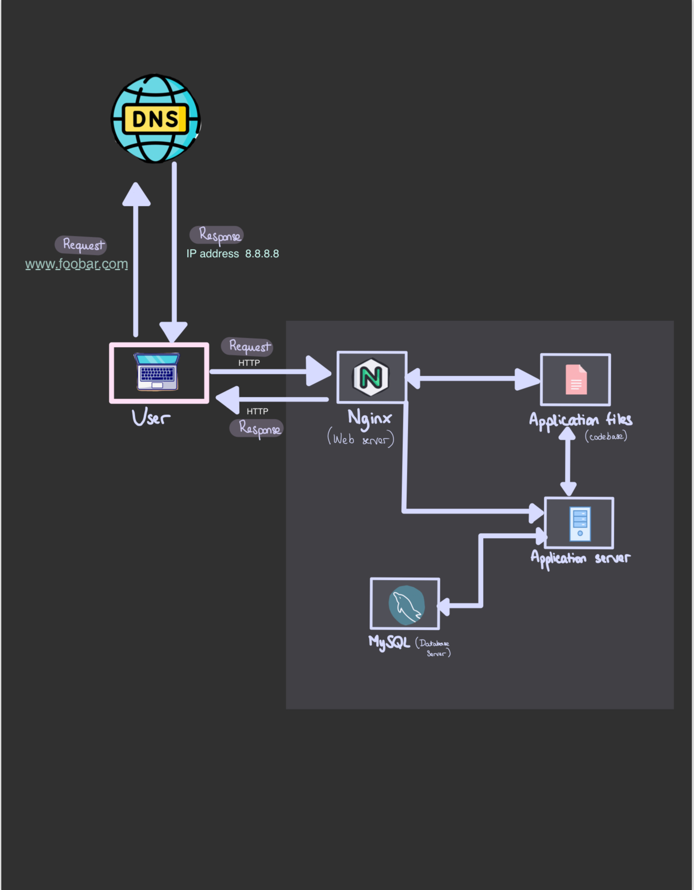

# Simple Web Stack

## Specifics About This Infrastructure

+ The **Server** is a physical or virtual machine thats hosts the website.

+ The **Domain Name** is the human readable address linked to the server IP. It makes us easier for us to browse websites.

+ The **DNS** (Domain Name System) translates domain name into IP address, sends the responde to the user's computer.

+ The **Web Server** is a software that accepts requests via HTTP(S) and responds with the requested resource.

+ The **Application Server** is a software framework that hosts and run web applications, executes application code, processes dynamic content and interacts with the database server.

+ The **Database** (MySQL) is a database management system that stores, manages et retrieves structured data to the websit's operation. 

## Issues With This Infrastructure

+ First issue is the **SPOF** (Single Point of Failure), that is if the server experiences hardware failure or service interruption, the website would become unavailable until issue is solved.

+ Another issue is the **Downtime** when something is not working, implementing updates or performing maintenances tasks. It would necessite to take the website offline for as long as it takes to resolve it.

+ And last but not least, the **Limited Scalability** with the incoming traffic. The server can quite easily run out or slow down if too many requests.