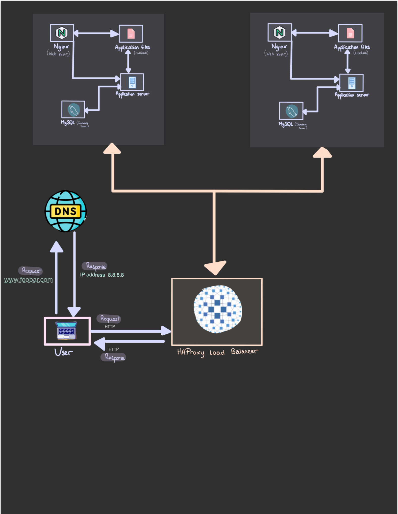

# Distributed Web Infrastructure

## Specifics About This Infrastructure

+ **Load Balancer Distribution Algorithm:** The HAProxy load balancer uses the Round Robin distribution algorithm. This means it cycles through each server behind it in a set order, making sure each server gets a fair share of requests. It can also adjust server priorities on the fly.

+ **Load-Balancer Setup:** The HAProxy load balancer sets up an Active-Passive system, not Active-Active. In an Active-Passive setup, some servers stay on standby until needed, while in Active-Active, all servers share the workload. This setup ensures better performance and response times.

+ **Primary-Replica Database Cluster Operation:** In a Primary-Replica setup, one server is the Primary and another is the Replica. The Primary handles both read and write tasks, while the Replica focuses on read tasks only. Data syncs between them whenever changes are made to the Primary.

+ **Difference Between Primary and Replica Nodes for the Application:** The Primary node manages write tasks for the application, ensuring data accuracy. The Replica node deals with read tasks, reducing the load on the Primary and improving overall performance.

## Issues With This Infrastructure

+ **SPOF:** We have several points where if something goes wrong, the whole system could fail. For instance, if the main MySQL database server isn't working, we can't update the website at all, like adding or removing users. Also, the server with the load balancer and the one connecting to the main database are also risky spots.

+ **Security issues:** In terms of security, our data traveling through the network isn't protected with SSL, so hackers could snoop on what's happening. And without a firewall, there's no way to stop unauthorized access from certain IP addresses.

+ Lastly, since we're not keeping an eye on each server, we wouldn't know if anything goes wrong or when it does
