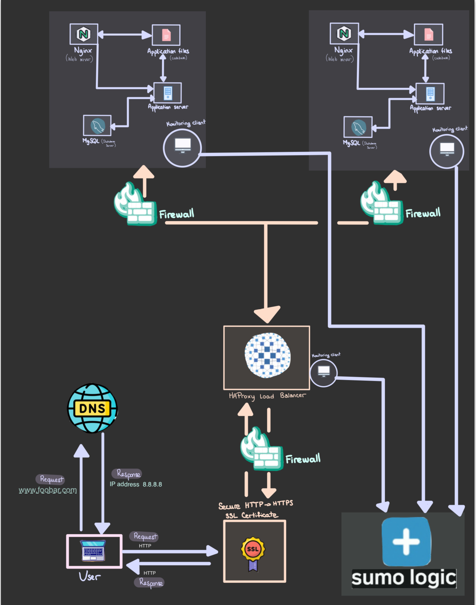

# Secure and Monitored Web Infrastructure

## Specifics About This Infrastructure

+ **The role of firewalls:** Firewalls act as guards for the network, especially web servers, keeping out unwanted users. They sit between the inside and outside networks, blocking any incoming traffic from sources that aren't supposed to be there.

+ **The role of SSL certificates:** SSL certificates help keep communications between web servers and the outside network private and secure. They encrypt the data, preventing sneaky attacks like man-in-the-middle snooping. This ensures that sensitive information stays safe and that the parties involved can trust each other.

+ **The role of monitoring clients:** Monitoring clients keep an eye on servers and the outside network. They check how well servers are performing, making sure they're healthy and working as expected. If something isn't right, they alert administrators, providing valuable insights into server operations. They also conduct regular tests to ensure servers are accessible and responsive, flagging any errors or security problems that pop up.

## Issues With This Infrastructure

+ Stopping SSL at the load balancer means the data between the load balancer and web servers isn't protected.

+ Relying on just one MySQL server is risky because it can't handle growing demands and might crash, taking down the whole web system.

+ Using identical servers with the same parts means they'll fight for resources like CPU and memory. This can slow things down and make it hard to find and fix issues. Plus, it's tough to expand a setup like this.